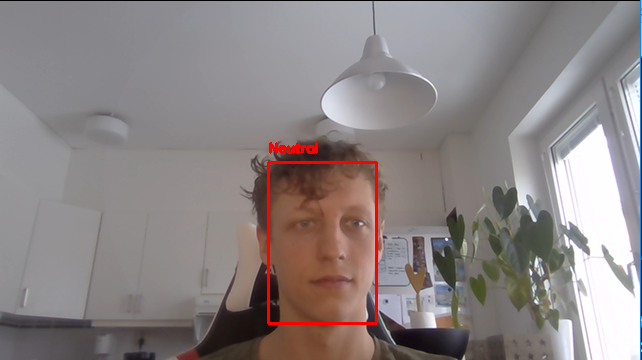
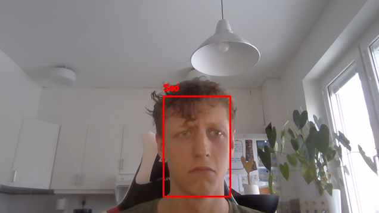
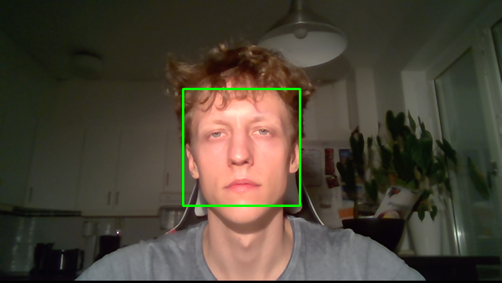
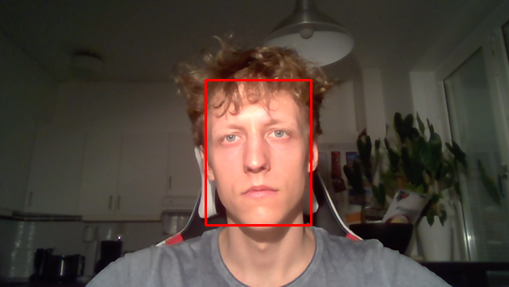

# Emotion-detection
This is a partial result of one part of the implementations made during a bachelor thesis work in face and emotion detection done between August 2018 through January 2019. Simply clone or download and choose the way you want to run the detection. All of the scripts requires pip and python to be installed on your computer. There are links and instructions provided at the bottom of this page if you do not already have those.

# Instructions
Check the README.txt in the Master_detection folder for the full installation instructions. The easiest way to run is to follow the given instructions and not manipulate the original folder structure. There are currently three scripts with different purposes. You can either run face detection for multiple faces in video footage or run emotion detection for either webcamera or your own input video. Please see instructions in the README.txt for further info.

# Examples of face detection and emotion detection

# Installation python+pip
NOTE: IF YOU ARE RUNNING PYTHON 2.7.9(or greater) or Python 3.4(or greater) you already have pip installed by default and can check if it works properly by just typing "pip" in command line. If you already have these installed you are good to go and can just move on to the README.txt in the Master_detection folder.
 If not follow these instructions: 
1: Get python -> https://wiki.python.org/moin/BeginnersGuide/Download 
2: Get pip -> https://www.makeuseof.com/tag/install-pip-for-python/ 

# Other info
The model is implemented with Keras using tensorflow backend, see the image in the Classification_model subfolder for more reference
on each layer included. There is another repository using the same CNN model as a feature extractor and then training machine learning
models on these features that will be put up in a week.

