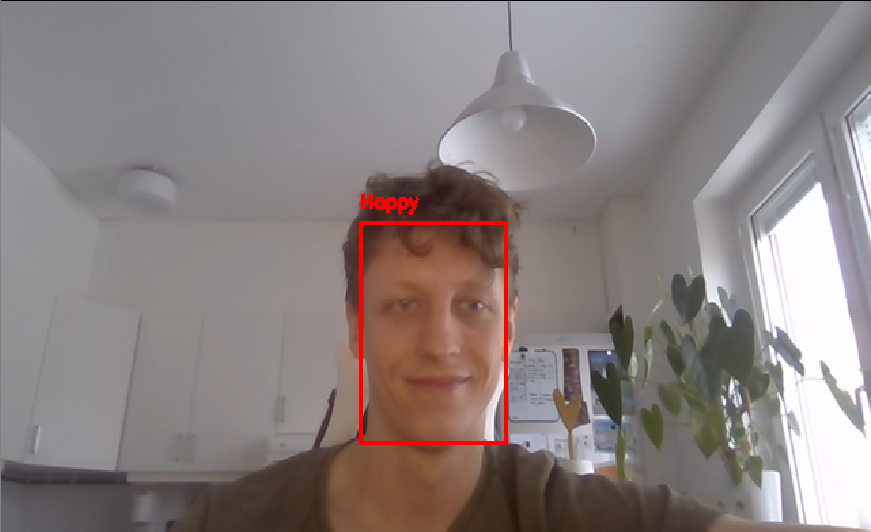

# Emotion-detection
Real-time face and emotion detection

This is a partial result of a bachelor thesis work in face and emotion detection done between August 2018 through January 2019.
Simply clone or download and choose the way you want to run the detection. There are two ways instructed below.

# Face detection
Navigate to the subfolder "detection" in the Master folder. There are two ways of performing detection included, either by Viola-Jones haar cascade classifier or by deep learning based ResNet model. These scripts are named accordingly
and there are two scripts that can be used. If you prefer the Spyder IDE, please run these scripts and input your paths manually into the
script at the top, along with the instructed other arguments. If you want to use commandline to run them, use those scripts and provide
required arguments. 

# Emotion detection
Navigate to the subfolder "Classification" in the Master folder. Just like in the detection steps, choose Spyder scripts or commandline
and provide the required arguments. There is a seperate other readme.txt inside this folder that gives instructions if you wish to use
another model than the one I provide and how to include more classes to output the appropriate text at the drawn bounding boxes.

# Examples of face detection and emotion detection

